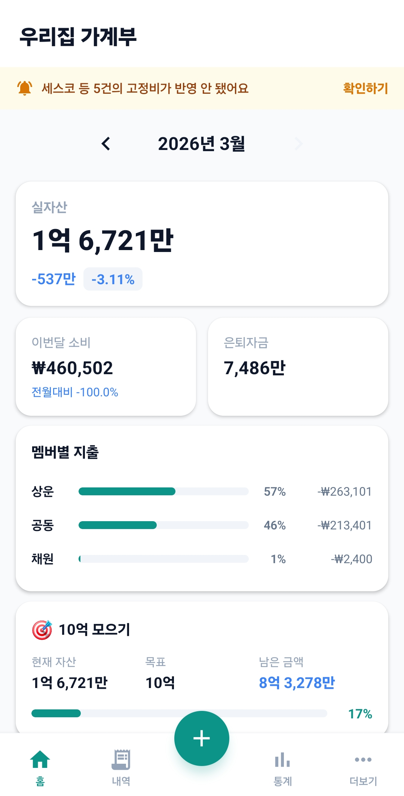
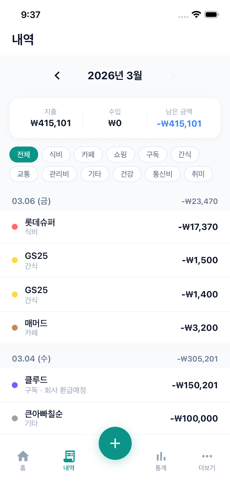
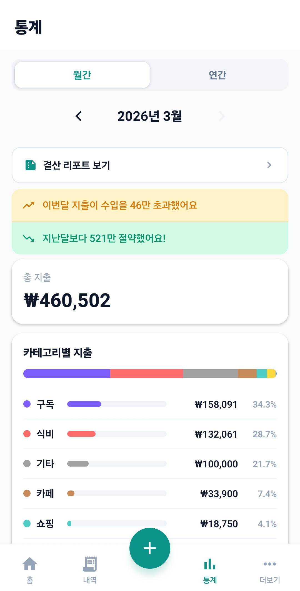

# 우리집 가계부 (Household Budget)

가족 단위로 수입/지출과 자산을 함께 관리하는 모바일 가계부 앱입니다.

## 주요 기능

- **거래 관리** - 수입/지출 내역 등록, 수정, 삭제
- **재무상태** - 실자산, 전세 포함 자산, 은퇴자금 월별 추적
- **통계 분석** - 카테고리별 지출 비율, 월별 추이 차트, 일별 소비 패턴
- **가족 협업** - 초대 코드 기반 가족 그룹, 멤버별 데이터 관리
- **자동 복사** - 새 달 진입 시 이전 월 자산 데이터 자동 이월

## 스크린샷

<p align="left">
  
  
  
  
</p>

## 기술 스택

| 영역       | 기술                        |
| ---------- | --------------------------- |
| Framework  | React Native 0.84, React 19 |
| Language   | TypeScript 5.8              |
| Navigation | React Navigation 7          |
| State      | Zustand, React Query        |
| Backend    | Firebase Auth, Firestore    |
| Auth       | Google Sign-In              |
| Charts     | react-native-chart-kit      |
| Forms      | React Hook Form + Zod       |

## 프로젝트 구조

```
src/
├── app/                  # 앱 진입점, 네비게이션
│   └── navigation/       # Root/Tab 네비게이터
├── features/             # 기능별 모듈
│   ├── auth/             # 로그인, 가족 설정
│   ├── home/             # 대시보드
│   ├── transactions/     # 거래 내역
│   ├── stats/            # 통계/차트
│   ├── assets/           # 재무상태/자산
│   └── settings/         # 설정
├── shared/               # 공통 컴포넌트, 유틸, 타입
└── store/                # Zustand 글로벌 스토어
```

## 시작하기

### 요구사항

- Node.js >= 22.11.0
- pnpm
- Xcode (iOS) / Android Studio (Android)

### 설치 및 실행

```bash
# 의존성 설치
pnpm install

# iOS 빌드 (최초 1회)
cd ios && pod install && cd ..

# Metro 번들러 시작
pnpm start

# iOS 실행
pnpm run ios

# Android 실행
pnpm run android
```

### Firebase 설정

1. Firebase 프로젝트 생성
2. `google-services.json`을 `android/app/`에 배치
3. `GoogleService-Info.plist`를 `ios/`에 배치
4. Firestore 및 Authentication(Google) 활성화
