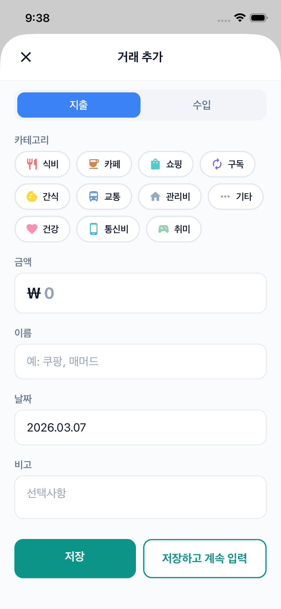
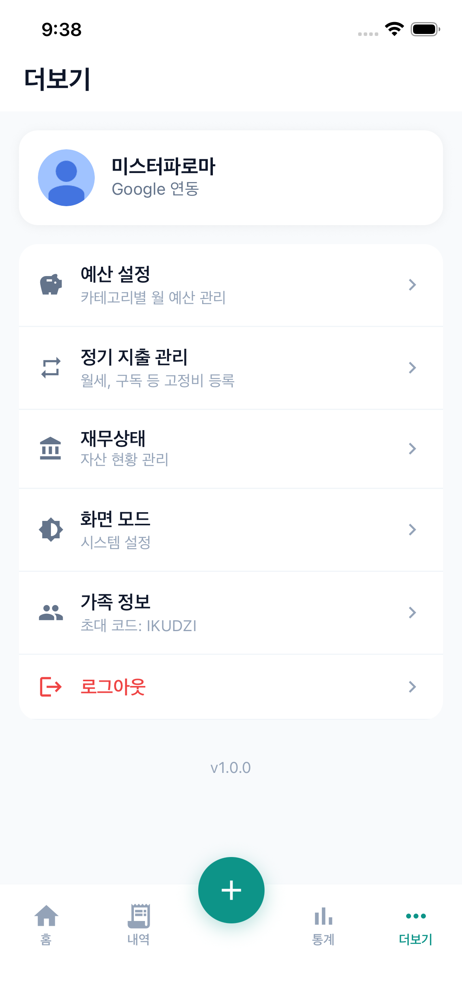
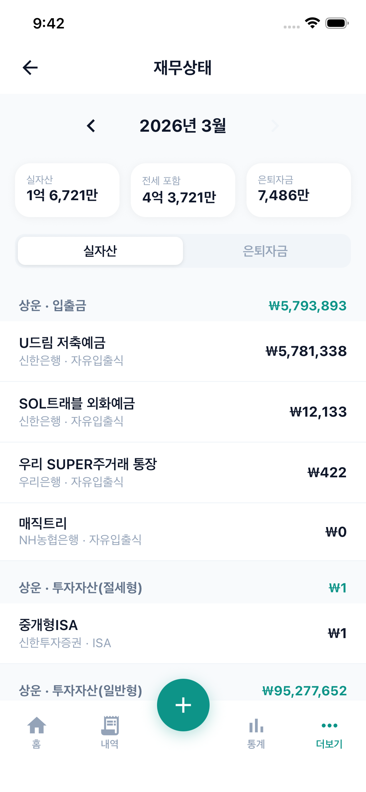
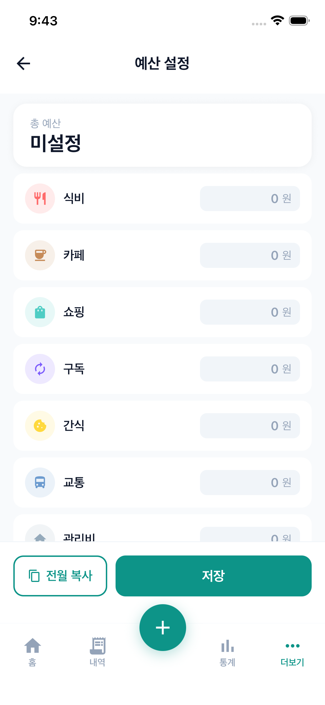
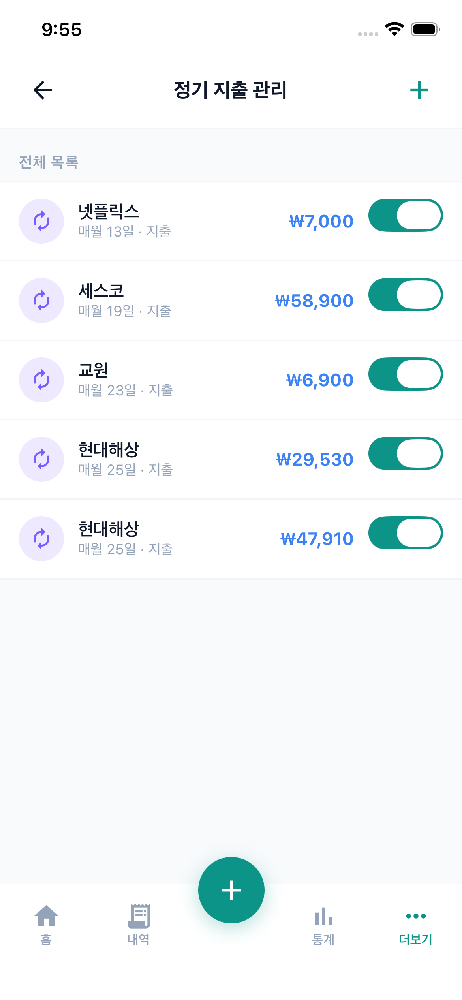

# 우리집 가계부 — 화면 디자인 현행화

> 캡처 기준: 2026-03-07 / iOS 시뮬레이터 (iPhone 16e)

---

## 화면 플로우

```
앱 실행
  └─ [미로그인] → 01. 로그인
                    └─ Google로 시작하기
                         ├─ [가족 없음] → FamilySetupScreen (새로 만들기 / 초대 코드 입력)
                         └─ [가족 있음] → 메인 탭

메인 탭 (하단 5개)
  ├─ 홈 탭          → 02. 홈
  ├─ 내역 탭        → 03. 거래 내역
  ├─ + (FAB)        → 04. 거래 추가 모달 (전역)
  ├─ 통계 탭        → 05. 통계
  └─ 더보기 탭      → 06. 더보기
                         ├─ 예산 설정    → 08. 예산 설정
                         ├─ 정기 지출 관리 → 09. 정기 지출 관리
                         ├─ 재무상태    → 07. 재무상태
                         ├─ 화면 모드   → (인라인 설정)
                         └─ 가족 정보   → (초대 코드 표시)
```

---

## 화면별 상세

### 01. 로그인 (LoginScreen)


| 항목 | 내용 |
|------|------|
| 경로 | 앱 최초 진입 또는 로그아웃 후 |
| 주요 요소 | 앱 아이콘, 앱명 "우리집 가계부", 부제, Google 로그인 버튼 |
| 액션 | Google로 시작하기 → Google OAuth 인증 |

---

### 02. 홈 (HomeScreen)


| 항목 | 내용 |
|------|------|
| 경로 | 메인 탭 > 홈 |
| 주요 요소 | 월 선택 네비게이터, 실자산 히어로 카드, 이번달 소비 / 은퇴자금 서머리 카드, 실자산 추이 라인 차트 (7개월), 월별 현황 리스트 |
| 인터랙션 | `<` `>` 로 월 이동 (uiStore.currentMonth), 실자산 카드 탭 → 재무상태 이동 |

---

### 03. 거래 내역 (TransactionListScreen)


| 항목 | 내용 |
|------|------|
| 경로 | 메인 탭 > 내역 |
| 주요 요소 | 월 선택, 지출/수입/남은금액 요약, 카테고리 필터 칩, 날짜별 그룹 거래 목록 |
| 인터랙션 | 카테고리 칩 탭으로 필터링, 거래 항목 탭 → 수정 (미구현), 스와이프 삭제 (미구현) |

---

### 04. 거래 추가 모달 (TransactionAddModal)



| 항목 | 내용 |
|------|------|
| 경로 | 하단 탭 + FAB 버튼 (어느 탭에서든 접근 가능) |
| 주요 요소 | 지출/수입 탭 전환, 카테고리 선택 (지출 11개 / 수입 5개), 금액 입력, 이름 입력, 날짜 선택, 비고 입력 |
| 액션 | 저장, 저장하고 계속 입력, X로 닫기 |

---

### 05. 통계 (StatsScreen)


| 항목 | 내용 |
|------|------|
| 경로 | 메인 탭 > 통계 |
| 주요 요소 | 월 선택, 총 지출 카드, 카테고리별 지출 (누적 바 + 랭킹 리스트), 월별 소비 추이 막대차트, 일별 지출 막대차트 |
| 인터랙션 | 월 이동으로 과거 통계 조회 |

---

### 06. 더보기 (MoreMenuScreen)



| 항목 | 내용 |
|------|------|
| 경로 | 메인 탭 > 더보기 |
| 주요 요소 | 프로필 카드 (이름 + Google 연동), 메뉴 리스트 (예산 설정, 정기 지출 관리, 재무상태, 화면 모드, 가족 정보), 로그아웃, 버전 |

---

### 07. 재무상태 (AssetScreen)



| 항목 | 내용 |
|------|------|
| 경로 | 더보기 > 재무상태 |
| 주요 요소 | 월 선택, 실자산 / 전세포함 / 은퇴자금 요약 카드, 실자산 / 은퇴자금 탭 전환, 소유자별 계좌 목록 (금액 표시) |
| 액션 | 계좌 탭 → 수정, + FAB → 계좌 추가, 전월 복사 |

---

### 08. 예산 설정 (BudgetScreen)



| 항목 | 내용 |
|------|------|
| 경로 | 더보기 > 예산 설정 |
| 주요 요소 | 총 예산 요약 카드, 카테고리별 예산 입력 필드 (11개) |
| 액션 | 전월 복사, 저장 |

---

### 09. 정기 지출 관리 (RecurringScreen)



| 항목 | 내용 |
|------|------|
| 경로 | 더보기 > 정기 지출 관리 |
| 주요 요소 | 전체 목록 (이름, 매월 N일, 지출/수입, 금액, 활성화 토글) |
| 액션 | 항목 탭 → 수정, 우상단 + → 추가, 토글로 활성/비활성 |

---

## 미캡처 화면

| 화면 | 설명 |
|------|------|
| FamilySetupScreen | 최초 가입 시 가족 생성 or 초대 코드 입력 |
| 거래 수정 | 거래 항목 탭 시 진입 (현재 UI 미구현) |
| 계좌 추가/수정 | 재무상태 내 + / 항목 탭 |
| 화면 모드 설정 | 라이트/다크/시스템 선택 |
